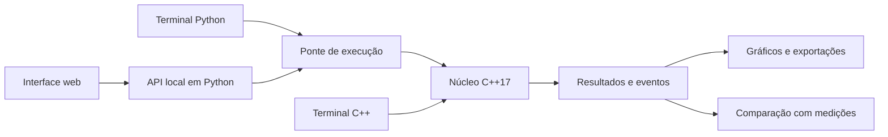

# Trajetória

**Laboratório local de simulação e análise de trajetórias de foguetes.**

O Trajetória integra um núcleo científico em **C++17**, uma aplicação em **Python** e uma interface web em português do Brasil. Permite configurar cenários de voo, importar curvas de empuxo, acompanhar a recuperação por paraquedas, consultar os cálculos e comparar resultados com medições fornecidas pelo usuário.

O terminal e a interface utilizam o mesmo núcleo de cálculo. A visualização espacial apresenta câmera orbital, reprodução temporal, gráficos e inspeção das forças ao longo do voo.

> **Versão 2.0.0 · protótipo científico.** Os testes verificam a implementação dentro de cenários definidos; não constituem validação experimental nem certificação de voo. Não há evidência que sustente uma precisão física de 99,9%. Os exemplos incluídos são sintéticos.

## Funcionalidades

- Trajetória translacional em três dimensões, no referencial leste–norte–cima (ENU).
- Empuxo constante ou curva tempo–empuxo importada de CSV e ENG/RASP.
- Interpolação linear do empuxo, impulso total, pico, média e duração da curva.
- Massa variável, gravidade, vento horizontal, densidade atmosférica exponencial e arrasto vetorial.
- Recuperação por apogeu, instante de voo ou altitude na descida, com atraso de ejeção e abertura progressiva.
- Registro de decolagem, fim de queima, apogeu, gatilho, ejeção, abertura e contato com o solo.
- Integração RK4 com estimativa de erro por subdivisão de passos e correção de Richardson.
- Memória de cálculo com forças, acelerações, pressão dinâmica e fração de abertura do paraquedas.
- Exportação de parâmetros, estudos JSON, telemetria CSV e relatórios de comparação.
- Comparação com medições por RMSE, erro absoluto médio, viés e erro absoluto máximo.

## Tecnologias e arquitetura

| Camada | Tecnologia | Responsabilidade |
|---|---|---|
| Núcleo científico | C++17 | Forças, integração, massa, estados e eventos |
| Aplicação local | Python 3.10+ | Configuração, importação de motores, API e análise de medições |
| Interface | HTML, CSS e JavaScript | Formulários, visualização em Canvas, gráficos e exportações |
| Compilação nativa | CMake 3.16+ e compilador C++17 | Executáveis independentes |
| Execução alternativa | WebAssembly/WASI e Node.js | Execução do mesmo núcleo C++ |



Não são necessários banco de dados, conta de usuário, arquivo `.env`, dependências Python externas ou pacotes npm. Depois de instaladas as ferramentas de execução, o cálculo funciona localmente, sem serviços remotos.

## Instalação

### Compilação nativa

Instale Python 3.10 ou superior, CMake 3.16 ou superior e um compilador compatível com C++17, como GCC, Clang ou MSVC. Na raiz do projeto:

```sh
cmake -S . -B build -DCMAKE_BUILD_TYPE=Release
cmake --build build --config Release
python -m trajetoria app
```

O aplicativo abre em **http://127.0.0.1:8765**. Para encerrar o servidor iniciado pelo terminal, pressione `Ctrl+C`.

Alternativamente, com GCC ou Clang no `PATH`:

```sh
python build.py
python -m trajetoria app
```

Para escolher outra porta ou impedir a abertura automática do navegador:

```sh
python -m trajetoria app --port 8767 --no-browser
```

No Windows, `iniciar.pyw` inicia o servidor sem janela de terminal, desde que o Python esteja associado a arquivos `.pyw` e o núcleo esteja compilado. A interface é uma aplicação web local, não um pacote desktop nativo.

### Alternativa WebAssembly no Windows

O caminho WASI foi verificado com **Zig 0.15.2** e **Node.js 24**. O script atual espera o compilador em `.tools/zig*/zig.exe`. Obtenha o Zig no [site oficial](https://ziglang.org/download/) e verifique a integridade do download antes de extrair os arquivos. Compiladores e binários não são distribuídos neste repositório.

```sh
python build.py --wasm
python -m trajetoria app
```

No Windows, a ponte Python prefere o módulo WASI quando ele está disponível e o Node.js é encontrado. Evite utilizar um módulo antigo ao verificar alterações no código. O executor WASI disponibiliza o diretório de trabalho ao módulo; não representa uma garantia de isolamento para código de terceiros.

## Uso pelo terminal

Exibir a ajuda e a configuração padrão:

```sh
python -m trajetoria --help
python -m trajetoria config
```

Executar um cenário sintético:

```sh
python -m trajetoria simulate --config exemplos/padrao.json --output estudo.json --csv telemetria.csv
```

Comparar passos de integração:

```sh
python -m trajetoria convergence --config exemplos/padrao.json
```

Comparar medições ilustrativas:

```sh
python -m trajetoria validate --config exemplos/padrao.json --data exemplos/medicoes_formato.csv --output comparacao.json
```

O executável C++ também pode ser utilizado diretamente:

```sh
./build/flight_cli --thrust 12 --elevation 85 --json estudo.json --csv telemetria.csv
```

No Windows, utilize `build\flight_cli.exe` ou `build\Release\flight_cli.exe`, conforme o gerador. Para WASI:

```sh
node run-core.mjs --thrust 12 --json estudo.json --csv telemetria.csv
```

O protocolo `--stdin` do executável é textual e interno; não recebe JSON diretamente. Para executar uma configuração JSON completa, inclusive com curva e recuperação, utilize `python -m trajetoria simulate --config arquivo.json`.

## Fluxo da interface

1. Escolha um cenário ou informe os parâmetros do veículo e do ambiente.
2. Selecione empuxo constante ou importe uma curva de motor. Arquivos ENG com vários motores exigem seleção.
3. Se desejar, habilite o paraquedas e configure gatilho, atraso, tempo de abertura, área e coeficiente de arrasto.
4. Execute a simulação. Alterações no formulário não modificam o estudo anterior até uma nova execução.
5. Reproduza o voo e consulte a memória de cálculo no instante escolhido.
6. Compare passos temporais ou importe medições na página de validação.
7. Exporte os parâmetros, a telemetria ou o estudo completo.

O foguete e o paraquedas desenhados são ilustrações ampliadas. A orientação visual não representa uma previsão de atitude ou estabilidade aerodinâmica.

## Curvas de empuxo

O CSV utiliza segundos e newtons, com cabeçalho `time,thrust`, vírgula como separador e ponto decimal:

```csv
time,thrust
0,0
1,20
2,0
```

Esse exemplo é uma curva triangular **sintética**, com impulso total de 20 N·s. O arquivo [exemplos/motor_sintetico.csv](exemplos/motor_sintetico.csv) pode ser utilizado para experimentar a importação.

O importador rejeita dados não finitos, tempos repetidos ou fora de ordem, empuxo negativo e término sem empuxo zero. Não ordena, suaviza ou completa uma curva CSV silenciosamente. No formato ENG, respeita a origem implícita `(0, 0)` e mantém os motores separados. Dimensões de catálogo são interpretadas em milímetros e massas em quilogramas, conforme a [especificação RASP](https://www.thrustcurve.org/info/raspformat.html).

As massas do veículo não são alteradas automaticamente a partir do catálogo. A massa seca deve incluir estrutura, carcaça vazia e equipamento de recuperação. O formato RSE ainda não é suportado.

## Medições e exportação

O CSV de comparação exige `time` e pelo menos uma grandeza: `altitude`, `east`, `north` ou `speed`. São aceitas de 2 a 10.000 observações, com tempos estritamente crescentes e dentro do período simulado. O referencial espacial e a origem temporal devem corresponder aos do modelo.

```csv
time,altitude
0.0,0.0
0.5,2.3
1.0,9.5
```

O sistema interpola as amostras do modelo para os instantes medidos, sem extrapolação. Não realiza sincronização automática, calibração de parâmetros ou estimação da incerteza dos sensores. O CSV completo de telemetria contém outras colunas e não deve ser confundido com o arquivo de medições.

Estudos JSON preservam configuração, pontos da curva, versão do modelo, eventos e amostras. A interface acrescenta a data de execução e os relatórios disponíveis. Importar um estudo recupera sua configuração; não restaura automaticamente os relatórios anteriores.

Cada exportação pela interface também gera uma cópia em `output/exports/`. Estudos em memória não são recuperados automaticamente após recarregar a página. Dados particulares e resultados gerados devem permanecer fora do versionamento.

## Modelo físico e limites

O modelo considera um ponto material, um estágio, solo plano, gravidade uniforme, vento horizontal constante e densidade exponencial. Em voo livre:

```text
A = π d² / 4
ρ(h) = ρ₀ exp(−max(h, 0) / 8500)
v_rel = v − [vento_leste, vento_norte, 0]
D = −0,5 ρ (Cd A + CdA_recuperação) |v_rel| v_rel
dv/dt = (T u + D) / m + [0, 0, −9,80665]
dr/dt = v
```

O vetor `u` é definido pelos ângulos configurados e permanece fixo. No modo constante, o consumo de massa é linear no tempo. No modo de curva, é proporcional ao impulso acumulado, sob a hipótese de velocidade efetiva de exaustão constante; uma curva de empuxo, isoladamente, não determina a história real de massa.

O paraquedas acrescenta uma área efetiva de arrasto que cresce linearmente entre a ejeção e a abertura completa. Posição e velocidade permanecem contínuas. O modelo não impõe velocidade terminal instantânea nem calcula choque estrutural de abertura.

O integrador controla uma estimativa **local** de erro, respeita fronteiras temporais e localiza apogeu, altitude de disparo e solo por bisseção. A tolerância numérica não representa uma garantia de erro global ou de precisão experimental. O máximo de velocidade informado é amostrado.

Não estão contemplados: atitude 6-DOF, sustentação, estabilidade aerodinâmica, Cd dependente de Mach/Reynolds, atmosfera por camadas, meteorologia variável, múltiplos estágios, oscilações do paraquedas, cargas estruturais, órbitas ou propagação de incertezas. Os limites de entrada são guardas computacionais, não um envelope físico validado.

## Testes

Após compilar:

```sh
python run-tests.py
```

Execução independente:

```sh
ctest --test-dir build -C Release --output-on-failure
python -m unittest discover -s tests -v
```

A revisão corrigiu as regressões identificadas e ampliou as verificações para curvas, recuperação e entradas inválidas. O [registro de verificação](VERIFICACAO.md) informa os resultados, o ambiente utilizado e as limitações da evidência.

## Estrutura do repositório

```text
native/                   Modelo físico, terminal C++ e testes analíticos
trajetoria/               Aplicação Python, API, importadores e comparação
trajetoria/static/        Interface web e visualização em Canvas
tests/                    Testes de integração e regressão
exemplos/                 Configurações e dados sintéticos
analises/                 Experimento numérico reproduzível
docs/                     Arquitetura, contratos e hipóteses
scripts/                  Verificação dos arquivos preparados para publicação
CMakeLists.txt            Compilação nativa e CTest
build.py                  Compilação direta e alternativa WASI
run-core.mjs              Executor WASI do núcleo C++
run-tests.py              Executor das suítes de verificação
iniciar.pyw               Inicialização local no Windows
```

## Documentação e contribuição

- [Arquitetura e contratos](docs/ARQUITETURA.md)
- [Registro de verificação](VERIFICACAO.md)
- [Orientações de segurança](SECURITY.md)
- [Guia de contribuição](CONTRIBUTING.md)

Contribuições devem incluir uma descrição do problema, hipóteses adotadas e verificação reproduzível. Dados reais só devem ser incluídos com autorização e documentação de origem, unidades, referencial e incerteza.

## Referências

- [NASA Glenn — Flight of a Model Rocket](https://www1.grc.nasa.gov/beginners-guide-to-aeronautics/flight-of-a-model-rocket/).
- [NASA Glenn — Ideal Rocket Equation](https://www1.grc.nasa.gov/beginners-guide-to-aeronautics/ideal-rocket-equation/).
- [ThrustCurve — RASP File Format](https://www.thrustcurve.org/info/raspformat.html).

As referências não representam endosso institucional ou validação deste software. A escolha de uma licença de distribuição permanece pendente; nenhuma licença foi atribuída automaticamente nesta revisão.
